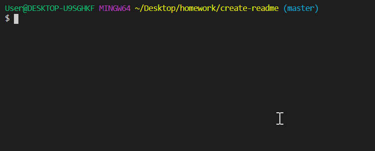

<h1 align="center">create-readme</h1> 
  <h2>Table of Contents<h2>
  <ul>
    <li>
      <a href="#description">Description</a>
    </li>
      <li><a href="#demo">Demo</a>
    </li>
      <li><a href="#instructions">Instructions</a>
    </li>
      <li><a href="#tech">Technology</a>
    </li>
      <li><a href="#license">License</a>
    </li>
      <li><a href="#contributors">Contributors</a>
    </li>
  </ul>
    

  
<h2>Description</h2> 

  

    Takes input about your project and returns well formatted starter README.md file.
     
    Add more markdown to suit your project's specific needs.
  

   
  

  
<h2>Demo</h2>

    

  
  

  
  
<h2>Instructions</h2> 

  

  Currently a backend-only project.
   
  In your preferred terminal:
   
  - Clone or fork repository
   
  - Run 'node index.js'
   
  - Answer the prompts to the best of your ability
   
  - Copy & paste the contents of created file into your project's README.md file!
   
  Delete your PASTEME.md file when finished, or leave it to be overwritten upon next use!
  

  
  

  
  
<h2>Technology</h2>
           
  
HTML, JavaScript, Node/Express.js

  
  

  
  
<h2>License</h2>

  

 
  
  

  
  
<h2>Contributors</h2> 

    

    Github:
      <a href="https://github.com/gregroyclark/">
        https://github.com/gregroyclark/
      </a>
  
