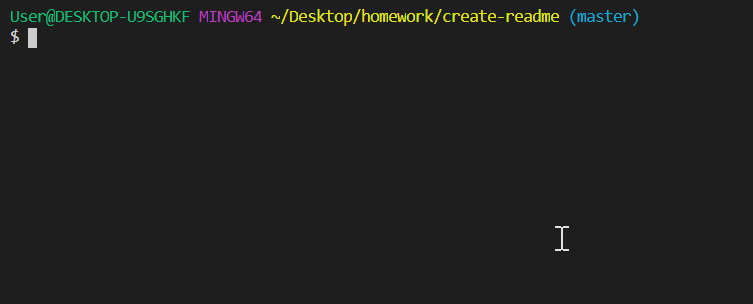

# create-readme

A repo-aware CLI that turns facts already in a project into a clean, useful README.


> Version 2 is available as a public beta and remains under active development.

Website: [createreadme.com](https://createreadme.com)

## Why this exists

The original 2020 project asked a short series of questions and wrote the answers into `PASTEME.md`. Version 2 keeps that friendly workflow, but starts by inspecting the repository so developers only answer what the code cannot already tell us.

- Detects package metadata, Git remotes, languages, scripts, runtime, license, and demo media
- Asks focused questions instead of presenting a hard-coded technology checklist
- Produces clean GitHub-flavored Markdown
- Previews and validates output before an interactive write
- Protects existing files during non-interactive runs
- Supports deterministic dry-run and CI check modes
- Generates restrained Shields.io badges from detected facts

## Try it

Version 2 currently requires Node.js 22.13 or newer.

```bash
npx @gregroyclark/create-readme
```

## Commands

```text
create-readme                       Scan, prompt, preview, and write README.md
create-readme --dry-run             Print Markdown without writing
create-readme --yes                 Generate without prompts
create-readme --check               Fail when README.md is missing or stale
create-readme --output docs/intro.md Choose another output file
create-readme --save-config         Save reproducible choices
```

Run `create-readme --help` for every option. Non-interactive generation never overwrites an existing file unless `--force` is provided.

## Configuration

Add `readme.config.json` when the same choices should be reusable locally, in CI, and eventually in the visual Studio and GitHub Action.

```json
{
  "title": "create-readme",
  "description": "Generate polished README files from repository context.",
  "sections": [
    "features",
    "demo",
    "installation",
    "usage",
    "technology",
    "contributing",
    "license",
    "author"
  ],
  "features": [
    "Scans the repository before asking questions",
    "Generates clean GitHub-flavored Markdown"
  ],
  "badges": ["license", "node"],
  "badgeStyle": "flat-square"
}
```

Detected values remain the default. Configuration only overrides the choices that should be intentional and repeatable.

## Programmatic core

The scanner and renderer are public so future interfaces do not need to reimplement README generation.

```js
import {
  createReadmeModel,
  inspectRepository,
  renderReadme,
  validateReadme,
} from "@gregroyclark/create-readme/core";

const facts = await inspectRepository({ root: process.cwd() });
const model = createReadmeModel(facts, { badgeStyle: "flat-square" });
const markdown = renderReadme(model);
const validation = await validateReadme(markdown, { root: process.cwd() });
```

## Product direction

The terminal is the first surface over a shared engine:

1. **Terminal CLI** — fast, local README creation for everyday use
2. **Local Studio** — visual section editing, badge styling, and live preview
3. **GitHub Action** — reviewable README maintenance through pull requests

See [the v2 product and technical specification](docs/v2-spec.md) for the boundaries between those surfaces.

## Development

```bash
npm install
npm test
npm run test:coverage
npm run check
```

The test suite uses Node's built-in test runner and covers remote parsing, repository inspection, model overrides, badge rendering, Markdown validation, CLI flags, safe writes, and CI checks.

The website is a dependency-light static build served by Cloudflare Pages:

```bash
npm run site:dev
npm run site:check
```

## The original

This was one of my first JavaScript projects. The original terminal demo is staying in the repository as part of that history:



## License

[MIT](LICENSE) © 2020–2026 Greg Clark
