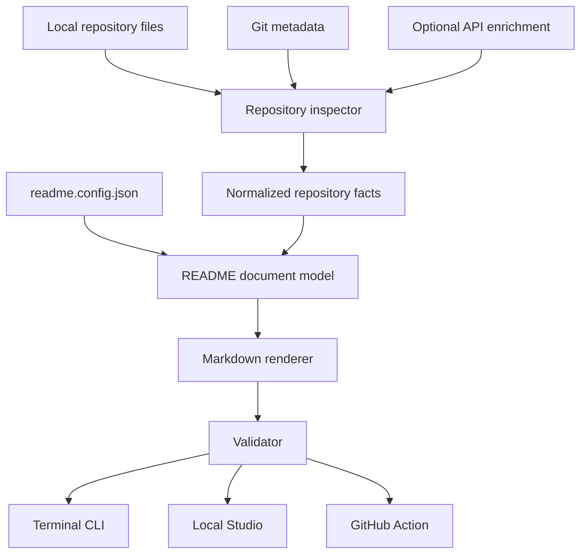

# create-readme v2 specification

## Product promise

Create a strong README with less typing by detecting what the repository already knows, asking only for missing context, and making every write reviewable.

## Product principles

1. **Local first.** The core experience works without an account, token, hosted service, or AI provider.
2. **Detected, then confirmed.** Repository facts become editable defaults rather than invisible assumptions.
3. **One document model.** The CLI, Studio, and GitHub Action use the same scanner, configuration, renderer, and validator.
4. **Safe by default.** Interactive runs preview before writing. Automated runs protect existing files unless explicitly allowed to overwrite them.
5. **Deterministic before generative.** Optional AI may improve prose later, but a reproducible non-AI path remains complete.
6. **Markdown over decoration.** Output should be readable in source form and rendered form. Raw HTML is reserved for cases Markdown cannot express.

## Shared architecture



### Repository facts

The inspector may detect:

- Project and package name
- Package description and version
- Package manager and lockfile
- Normalized install, development, build, preview, validation, test, and binary commands
- Node.js runtime requirement
- Git remote, repository owner, repository name, and default branch
- Source languages by file extension
- Frameworks, UI libraries, integrations, and test tools from package dependencies
- High-confidence architecture relationships from configured integrations and source usage
- Familiar application paths and their likely responsibility
- Supported deployment configuration and publish directory
- License identifier and license file
- Demo images
- Contributing guide
- GitHub Actions workflows

Facts are data, not rendered Markdown. A new interface should consume the fact object rather than inspect the repository again.

### README document model

The document model combines facts with intentional overrides:

- Title and description
- Ordered section identifiers
- Optional features
- Installation and usage commands
- Application command table
- Architecture summary and supporting evidence
- Project structure
- Testing commands and deployment details
- Demo media
- Technology list
- License and author
- Selected badges and visual badge style
- Warnings about incomplete or conflicting repository metadata

### Configuration

`readme.config.json` stores only durable choices. It is safe to commit and should work across every product surface.

Supported v2 fields:

```json
{
  "title": "Project title",
  "description": "One-sentence summary",
  "sections": ["commands", "architecture", "project-structure", "testing", "deployment", "technology"],
  "features": ["First feature"],
  "badges": ["license", "npm-version", "node", "ci"],
  "badgeStyle": "flat-square",
  "demoPath": "assets/demo.gif",
  "installCommand": "npm install",
  "usageCommand": "npm start",
  "commands": [
    { "id": "dev", "command": "npm run dev", "description": "Start the development server" }
  ],
  "architecture": {
    "summary": "Astro owns routing and the production build, while React powers interactive components.",
    "evidence": ["astro.config.mjs", "src/pages/index.astro"]
  },
  "projectStructure": [
    { "path": "src/components", "description": "Reusable UI components" }
  ],
  "testing": {
    "commands": [
      { "id": "test:e2e", "command": "npm run test:e2e", "description": "Run end-to-end tests" }
    ]
  },
  "deployment": {
    "provider": "Netlify",
    "configFile": "netlify.toml",
    "publishDirectory": "dist"
  },
  "license": "MIT",
  "author": "github-user"
}
```

Unknown fields are ignored for forward compatibility. A future schema version may add explicit migrations if incompatible changes become necessary.

## Surface 1: terminal CLI

### Primary flow

1. Inspect the current directory.
2. Summarize detected facts.
3. Ask for title, description, sections, license, badges, and relevant commands.
4. Render and validate Markdown.
5. Show a numbered source preview.
6. Ask before writing or overwriting.
7. Optionally save the resolved configuration.

### Automation modes

- `--dry-run` writes only Markdown to standard output.
- `--yes` skips prompts and uses repository facts plus configuration.
- `--check` exits nonzero when the configured output is missing or stale.
- `--force` is required for non-interactive overwrites.
- `--output` and `--config` allow alternate paths.

Automation modes must not mix informational logs into Markdown output.

## Surface 2: local Studio

The Studio will be launched from the same package, likely through `create-readme studio`. It should:

- Run only on the local machine by default
- Display detected facts as editable suggestions
- Enable, disable, and reorder sections
- Compare curated badge styles
- Render a GitHub-flavored preview beside the editor
- Show validation findings and the final file diff
- Persist through the same configuration schema

The Studio must import the core package. It must not grow a separate scanner or renderer.

## Surface 3: GitHub Action

The Action will call the core in non-interactive mode and create a reviewable pull request when configured output changes. Initial triggers should be manual workflow dispatch and an explicit repository workflow—not an always-on hosted service.

The Action should:

- Require no external service for deterministic generation
- Reuse `readme.config.json`
- Report repository scan, Markdown validation, and link-check results
- Never push directly to the default branch
- Add optional API enrichment only when the workflow grants the necessary token permissions

## API strategy

No remote API is required for v2 CLI generation.

Optional enrichments may include:

- GitHub repository metadata, topics, languages, contributors, and detected SPDX license
- Shields.io badge URLs for package, license, runtime, and CI status
- GitHub Markdown rendering for high-fidelity Studio comparison
- A provider-neutral prose-assistance adapter for descriptions and examples

License selection remains an explicit user decision. An API may retrieve recognized license metadata or text, but it must not choose a license on the user's behalf.

## Current milestone

The first v2 milestone includes:

- Shared repository inspection, model, badge, rendering, validation, configuration, and write modules
- Interactive terminal generation
- Dry-run, check, forced overwrite, alternate output, and saved-config modes
- Public programmatic exports
- Automated tests and dependency audit

It intentionally excludes the Studio UI, GitHub Action packaging, hosted services, AI copy generation, and automatic license-file creation.

## Release gates

Before publishing the first v2 package:

- Confirm ownership of the `@gregroyclark` npm scope
- Run the test and dependency checks on Linux, macOS, and Windows
- Add a CI workflow using supported Node.js versions
- Record a fresh terminal demo
- Publish a beta tag before promoting `latest`
